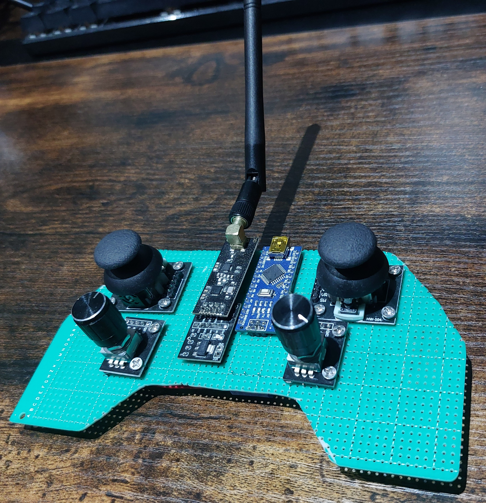
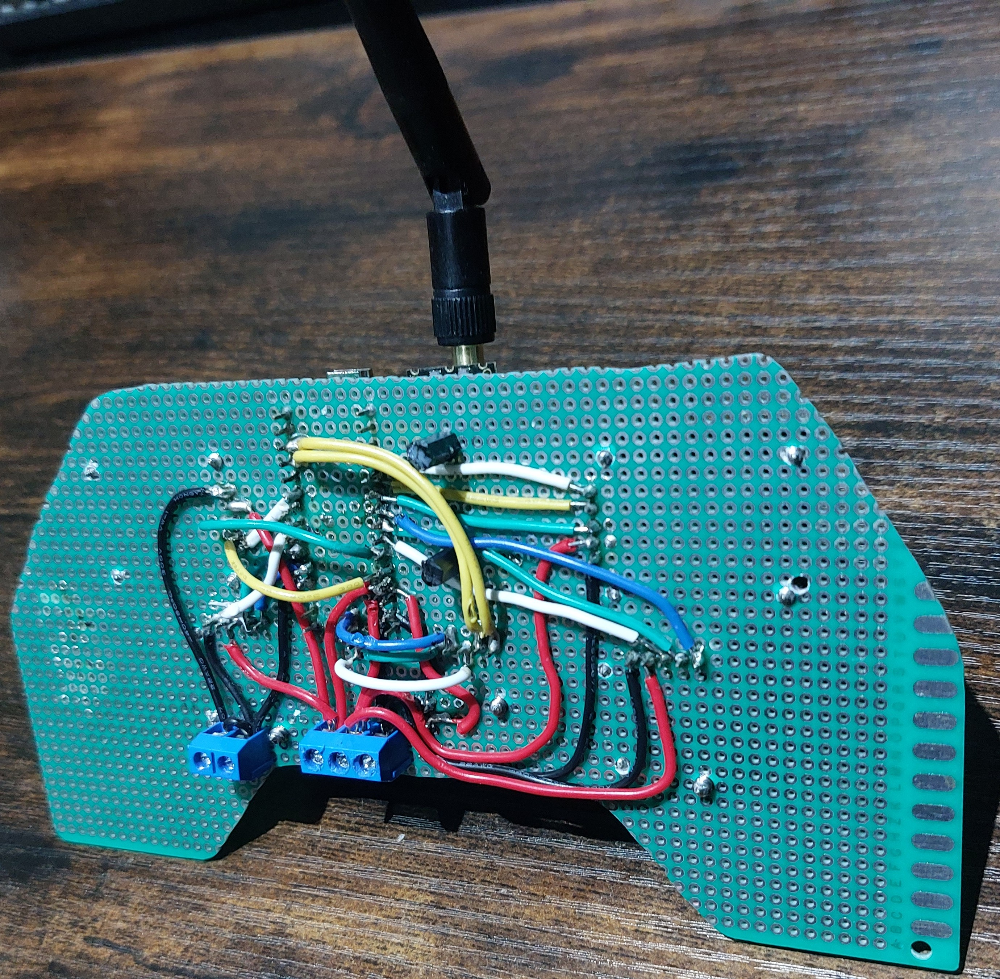
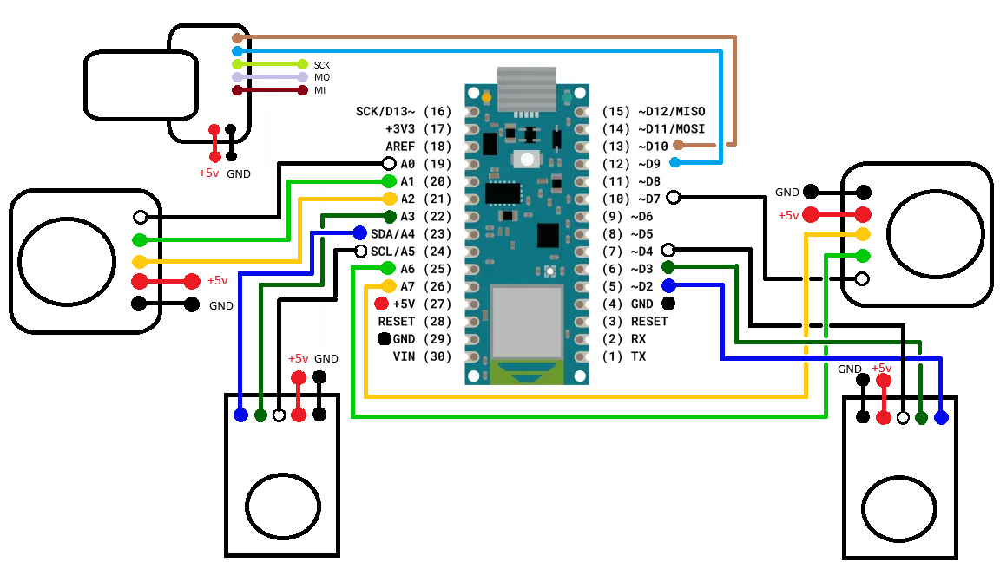

# Universal programmable radiofrequency controller using an arduino & P2P soldered prototype board.

This project is a general-purpose wireless controller built around an Arduino Nano and an nRF24L01 radio module, designed to be reused as the input for other hardware projects. It covers the full pipeline of getting a controller from planning layout to fully functioning: writing and debugging the Arduino firmware, transmitting and receiving data over radio, and building the physical unit by cutting and hand-soldering a point-to-point (P2P) prototype board rather than using a breadboard or off-the-shelf shield. A big part of the work was hardware-level debugging — diagnosing issues that only show up once code is running on real, soldered electronics rather than in simulation, having to use the serial terminal as to see what the board and radio module were actually doing.

 

## how to run
1) **Hardware setup**
    Hardware list:
        - Perfboard (prototype board)
        - Arduino Nano
        - nRF24L01 RF module
        - nRF24L01 breakout board
        - Thumbstick module ×2
        - Rotary encoder module ×2
        - Pin headers
   - *(picture 2)* shows the circuit diagram for wiring up the controller, ensure to use pin header to hold components in place on perfboard.
   - Wire up receiver arduino to rf module on solderless breadboard to test.

2) **Install dependencies**
   - Install [PlatformIO](https://platformio.org/)
   - Clone this repo:

```bash
     git clone https://github.com/Nirojan-Nagendram/universal_controller_rf_arduino.git
     cd universal_controller_rf_arduino
```

3) Upload code for whole_controller & receiver scripts found in the scripts folder.

5) Try it out while watching the terminal of the receiver arduino.

## Development diary 07/25 - 10/25
(Note: This project was made before I started using Git, so there is no version control with commits or exact dates)
**software** I started with the software - I wrote the firmware for the controller's arduino, set up the components on a solderless breadboard. Uploding the receiver script to another arduino/nrf module combo, to test the rf signal. The components all sent the correct signals. Other than the required functions for reading, transmitting & receiving, I included some to print the values. I was a bit inconsistent with this however, I may add one for each component.

**hardware, this has taken up most of the project so far, this was due to many different mistakes and their corrections.**
**Preparing the perfboard:** I laid the components into the desired, using this to determine best shape. I cut a copper hole plated perfboard into the shape using a diamond tipped dremel, *(picture 1)*. I needed to do this in a well ventilated room wearing a respirator to avoid inhaling fibreglass. I also used a marker on the holes to drill the screwholes for each component. Finished the board by cleaning it with 99% isopropyl alcohol. 

**First attempt - Pins!** This was my biggest mistake, I assumed if I used a large solid core wire that I wouldn't need pins to connect to the perfboard. I should have tested it component by component, however I rushed and built the whole controller on this misstep. This led to very inconsitent connections, especially for the analog components. O printed the values while using the components to fix it. This took me a while to diagnose as I assumed my soldering was just poor. I did noticed that if you the solder joints were had some pressure it would be more consistent. This is what led me to doing some researching into more stable conections, i.e. pins.

**Second attempt - the star grounding issue** With the previous mistake, I desoldered everything and restart. Unfortunately, the pads were not intact, so I had to recut a perfboard. I again placed the components, soldered them (with pins) this led to working prototype. Most of the components were working and data was being sent by the rf module. However, the thumstick module had a lot of variance. I noticed this didn't happen on my solderless board, and I realised it was due to my DIY star grounding. I soldered wires to the GND & V pins on the arduino, stuck them to the board, then connected each component to those. However this led to very messy wiring that began to interfere with the thumstick, likely due to the GND & V terminal lines being too close. 

**Third attempt - PCB terminal blocks** To fix the star grouding issue, I desoldered everything again. However, the pins meant the components (and more importantly the copper pads) could stay in place. Therefore I did not need to recut the perfboard. This time I used PCB terminal blocks, this was much simplier. This allowed me to easily connect each side of the controller to the correct block, then connect those blocks to the arudino. It did require some longer wiring, which could theroically cause more interference, however it is negligible compared to the star grounding issue.

**Final notes** This resulted in the design in *(picture 2)*. This was much cleaner, and should be easier to troubleshoot in the future if (when) need be. Any ground or voltage issues should be grouped based on the terminal. After testing, the potential interefere is not noticable. I also added deadzones, calibrated based on the range of readings I was getting with the thumbstick. I also altered the code, so it would only send signals when something was sent. This was just to making degbugging easier. 

## Pictures
 *(picture 1)*: controller
  

 *(picture 2)*: controller_back
  

 *(picture 3)*: circuit_diagram
 


## Known limitations
 - The screwholes would not always line up with the holes on the board. This wouldn't be a problem with a pillar drill, however it caused issues with my hand drill. The drill would tend towards the holes, making some of the components crooked. This was not an issues with things like the encoder, but it is a bit with the thumbstick. The deadzone helped though.
 - Limited buttons, the I would like many more buttons. However, I was running out of arduino pins & space. I decided to just to let it go.(https://www.youtube.com/watch?v=YVVTZgwYwVo) as most the components have buttons in built.
 - The controller has no battery pack, currently it requires you to plug in the arduino via the USB port.
 - The controller has no case, I may 3D print one, hence the battery pack isn't attached to the perfboard. As it would be simpler and more secure to integrate this into the model.

## Future plans & abandoned plans
- I plan to use this project as a controller for some others projects.
- I did attempt to use the controller to control a commercial RC car with my controller using RF hacking. However, this was unfeasible. The attempted to use a nrf module as a signal collector, to determine the RF signal sent from a commercial RC car. Although I do think I found some patterns, for forward, backwards & turning, when I attempted to use my controller to send those signals nothing happened. I think there was some encoding the car expected that I could not find online for the rf chip. I would need much better equipment or more expensive rc car to progress any further, so I accepted it wasn't doable.